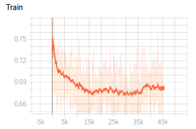
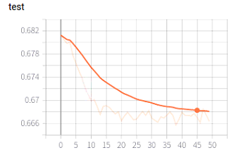
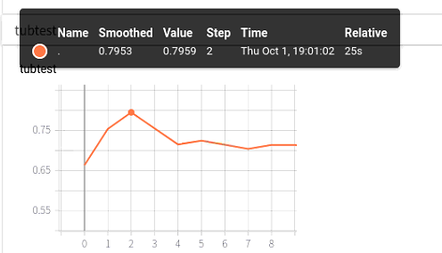
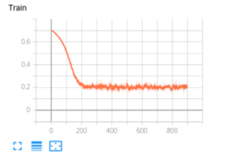
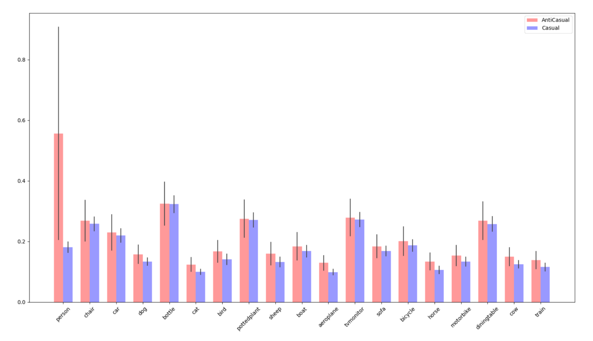

# NCC-pytorch
This project is a pytorch vision of NCC, which is about Discovering causal signals in images.

!!THIS IS AN UNFISHED PROJECT!!

# How to use it
## NCC
1. Use the NCC-datasetGen.py to produce the trainX and trainY data (in ./data), which train the NCC causal model.
2. Use the NCC-NN-training-torch.py to train the NCC causal model
3. Use the NCCTest.py to test the NCC causal model, and the test data is ./data/tubehengenDataFormat.json

## NCC-ResNet50
1. In ResNetNCC.py, use VOC2012 classification task to finetune the ResNet50, whose fc layer was replaced by a 512-512-20 dense layers.
2. After training the NCC-ResNet50, use it to generate the feature-class vectors in GenResNetNCCVector.py.
3. Use the NCCtest.py to deal with the feature-class vectors produced in NCC-ResNet50, and get the causal/anticausal score.
4. Use codeForIntervention.py to get the result.

# Problem
My NCC model get 74% acc in open-source datasets test

  

And NCC-ResNet50 get 93% acc in voc classification task, which is 79% and 97% in official tf version.

But when I connected both 2 models, I don't get the paper's results.

