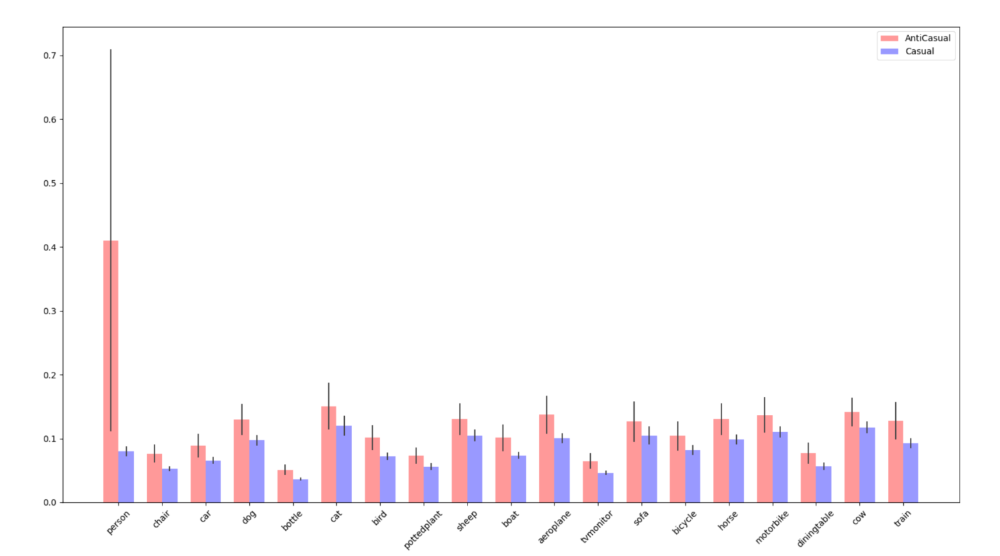

# NCC-pytorch
This project is a pytorch vision of NCC, which is about Discovering causal signals in images.

!!THIS IS AN UNFISHED PROJECT!!

# How to use it
## NCC
1. Use the NCC-datasetGen.py to produce the trainX and trainY data (in ./data), which train the NCC causal model.
2. Use the NCC-NN-training-torch.py to train the NCC causal model
3. Use the NCCTest.py to test the NCC causal model, and the test data is ./data/tubehengenDataFormat.json

## NCC-ResNet50
1. In ResNetNCC.py, use VOC2012 classification task to finetune the ResNet50, whose fc layer was replaced by a 512-512-20 dense layers.
2. After training the NCC-ResNet50, use it to generate the feature-class vectors in GenResNetNCCVector.py.
3. Use the NCCtest.py to deal with the feature-class vectors produced in NCC-ResNet50, and get the causal/anticausal score.
4. Use codeForIntervention.py to get the result.

# Problem
## NCC
My NCC model get 74% acc in Tuebingen datasets, which is 79% in official tf version.

I realize it in this way: 4 layers in NCC, the first 2 layers named embeded layers, and another 2 layers named classified layers. 

Every layer include: Linear => Normalization => ReLu => Dropout

The whole NCC model is: input => Embeded Layers => reduce_mean => Classified Layers => sigmoid => output, and the input is [B, data_size, 2], output is [B, 1]

  

## NCC-ResNet50
My NCC-ResNet50 get 93% acc in voc classification task, which is 97% in official tf version.

I realize it in this way:

imgs => ResNet50 (without the last fc layers) => features => 512-512-20

it is a multi-label learning task, freeze the ResNet50 grad to finetune the 3 layers network.

## Paper result
But when I connected both 2 models, I don't get the paper's results in context-feature:

object-features: 

context-features:

